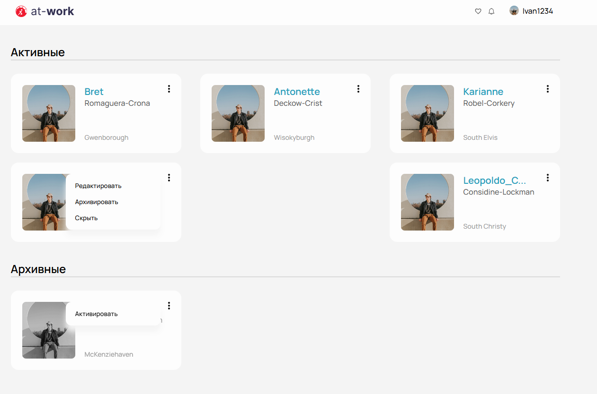
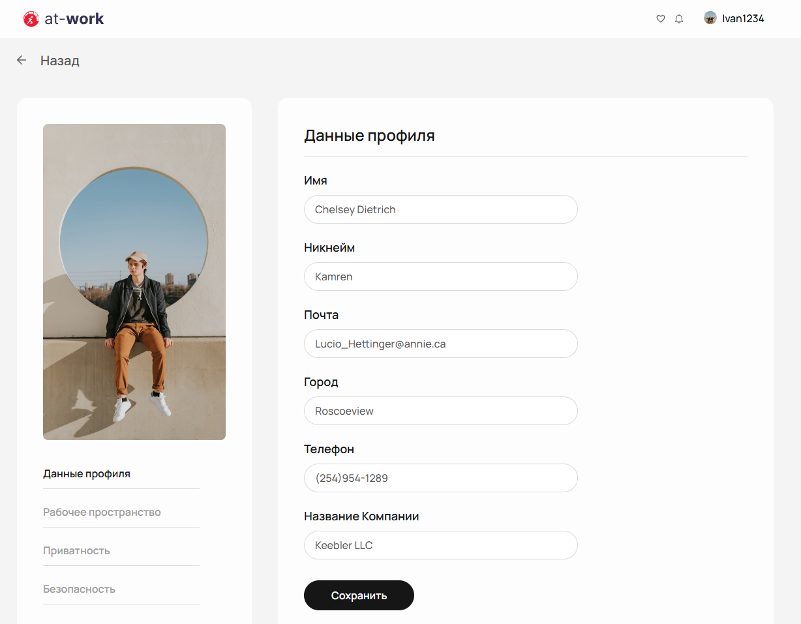

# Getting Started with the APP

#At-Work App

This document will provide you with an overview of the app and guide you through the process of setting it up and starting it.




**About the App**
At-Work App is an interface for SPA application. It provides users with access to a wide range of user profiles cards. The app consists of two pages: the home page and the page with profile editing. The home page displays a list of available user cards, while the editing page provides editor widget to change profile data.

The app is built using React, TypeScript, Redux Toolkit and styled using SCSS and Ant Design.

## Link to deploy

[DEPLOY](https://at-work-p6c1qn7n3-helga-umrikhs-projects.vercel.app/)

# Getting Started

## Installation

To install the app and its dependencies, follow the steps below:

1.  **Clone the repository:**
    Start by cloning the repository to your local machine using the following command:
    ```cpp
    git clone https://github.com/helga-umrikh/At-Work__App
    ```
2.  **Navigate to the project directory:**
    Once the repository is cloned, navigate to the project directory using the following command:
    ```cpp
    cd at-work-app
    ```
3.  **Install dependencies:**
    Before running the app install the package manager npm to install all the dependencies.
    ```cpp
    npm install
    ```

## Starting the App

To start the app, run the following command:

```cpp
npm start
```

This will start the development server and open the app in your default web browser. You should now be able to navigate to the home page and explore the posts available on the site.
